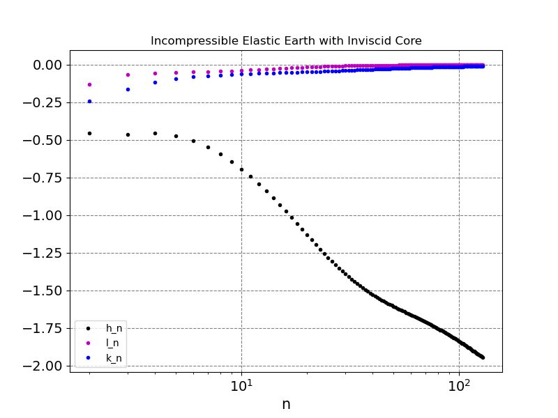

# ELLoveN
Welcome to ELLoveN, an Elastic Load Love Numbers Calculator for SNREI incompressible Earth models.  
For theoretical details see: Patrick WU and W. R. Peltier, "Viscous gravitational relaxation", 1982.

The code is located in ELLoveN.py.  
The Earth model is in Earth_Model.txt, where each line represents:  
  - bottom radius of the layer (km)
  - upper radius of the layer (km)
  - rigidity of the layer (100 GPa)
  - density of the layer (kg/m^3)
  - gravity of the layer (m/s^2)

The output files, with the computed Love's numbers, are h_n.dat, l_n.dat, k_n.dat.

In Earth_Model.txt you can define your Earth model, the first line should remain unchanged, you can modify all the others (mantle and lithosphere), you can also add new ones.

When the program is called from command line you have to specify the harmonic degree-range you want to compute and "constant" or "linear" in order to choose between a constant piece-wise profile for rigidity, density and gravity in the mante+lith or a linear profile.

Example: 

         python ELLoveN.py 2 128 constant

or

         python ELLoveN.py 2 128 linear

The quantities involved in the calculation have been non-dimensionalized using scales for mass, time and length.

Runge-Kutta 2 method was used for the integration of the ODEs involved.

In the current version of ELLoveN harmonic degree should remain below 1100 in order to avoid instabilities...

For everything you can write me: gianmarco.delpiccolo@studio.unibo.it

Have fun and test your Earth models!

